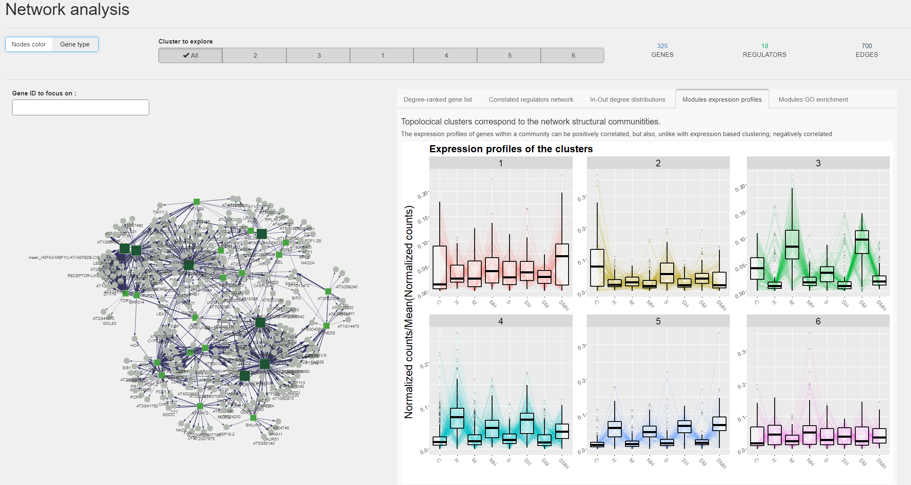

[](https://travis-ci.com/OceaneCsn/DIANE)


# Dashboard for the Inference and Analysis of Networks from Expression data 


DIANE is a shiny application for the analysis of high throughput gene expression data (**RNA-Seq**). Its function is to extract important regulatory pathways involved in the response to environmental changes, or any perturbation inducing genomic modifications.

Given the popularity of combinatorial approaches in experimental biology, we designed this tool to process, explore, and perform advanced statistical analysis on **multifactorial expression data** using state of the art methods. It includes :

+ Raw count data pre-processing and sample-wise normalisation
+ Customizable differential expression analysis

As several interactive tools already offer those kind of service, we try to go further in the analysis by proposing :

+ Expression based clustering in the framework of Poisson Mixture Models, and characterisation of those clusters with generalized linar models and GO enrichment analysis

+ Machine learning based Gene regulatory network inference


As many biologists feel more comfortable with user interfaces rather than code, all of the features in DIANE are accessible via a signle page shiny application that can be locally launched.



For more advanced users, all server-side functions in DIANE are exported so they can be called from R scripts. 

Fore more information, please find full documentation and examples in the github page  https://oceanecsn.github.io/DIANE.


**DIANE is in an early stage of development**.

DIANE relies on R 4.0.0, available for all OS at https://cloud.r-project.org/.

Download and install DIANE in your R console as follows :

```R
library(remotes)
remotes::install_github("OceaneCsn/DIANE")
```

You can then launch the application :

```R
library(DIANE)
DIANE::run_app()
```
In case your expression input file exceeds 5MB, you may need to run the command ```options(shiny.maxRequestSize=30*1024^2)``` before calling ```DIANE::run_app()``` to upload up to 30BM.

Once the application is launched, if the resolution poorly fits your screen, you can adjust it with the keyboard shortcuts ```ctrl +``` or  ```ctrl -``` (use ```cmd``` on Mac).
 

Authors : Océane Cassan, Antoine Martin, Sophie Lèbre

PhD Student at BPMP (Plant Biology and Molecular Physiology) research unit, SUPAGRO Montpellier.
