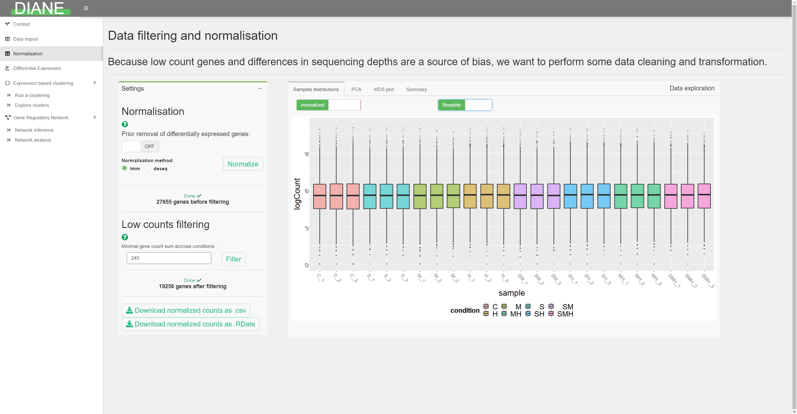
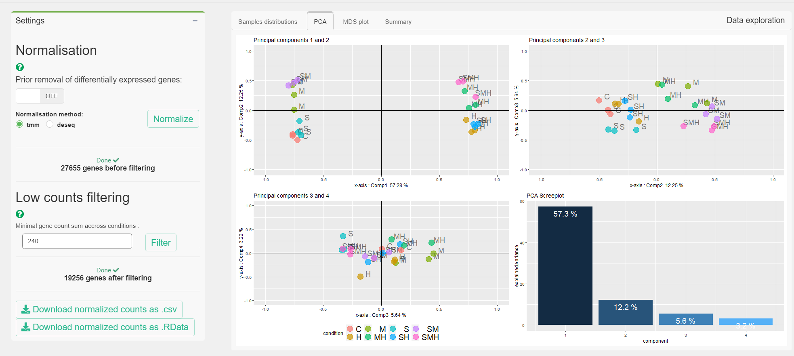
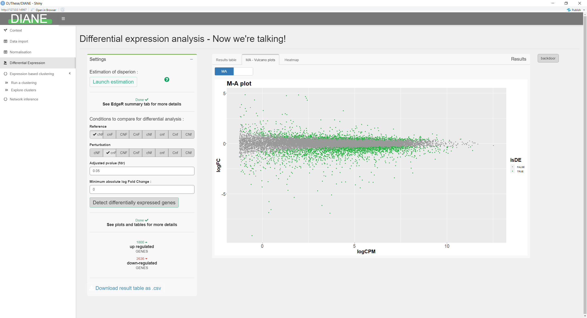
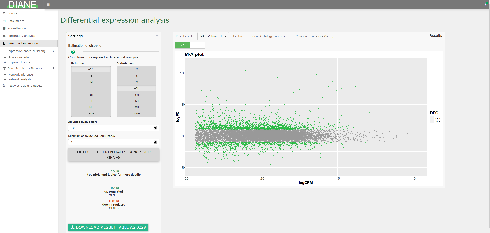
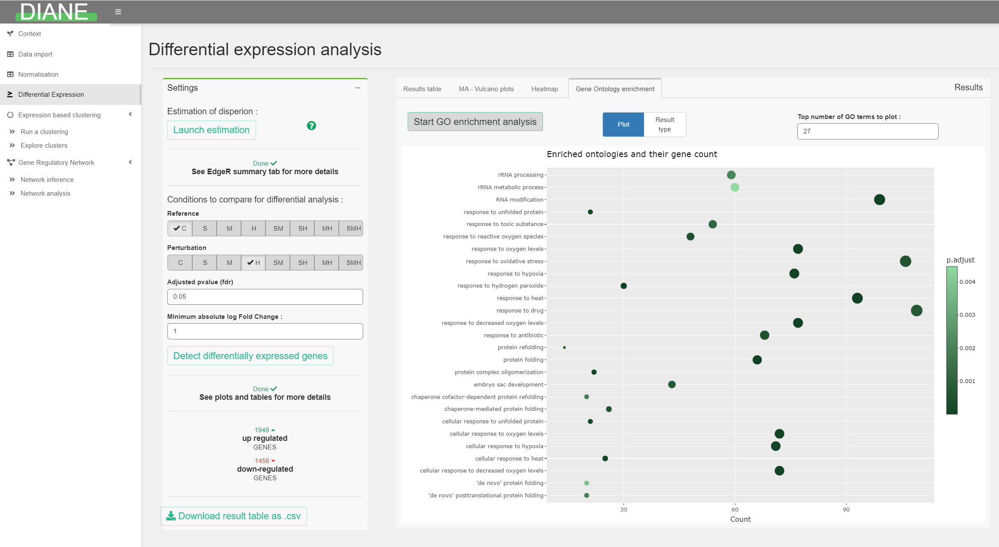
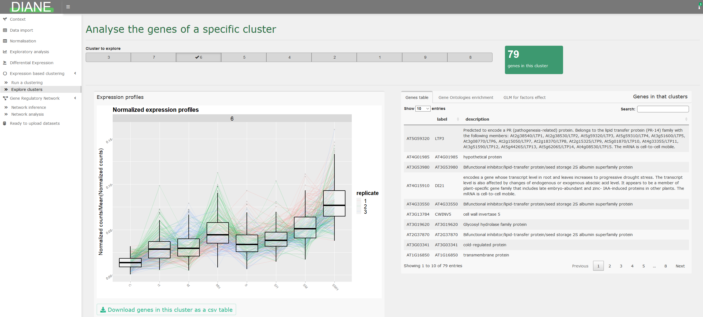
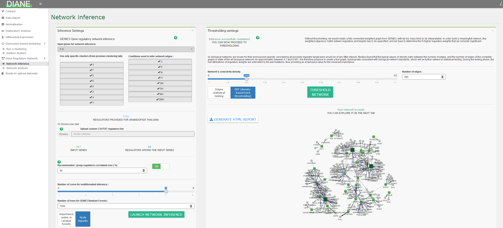
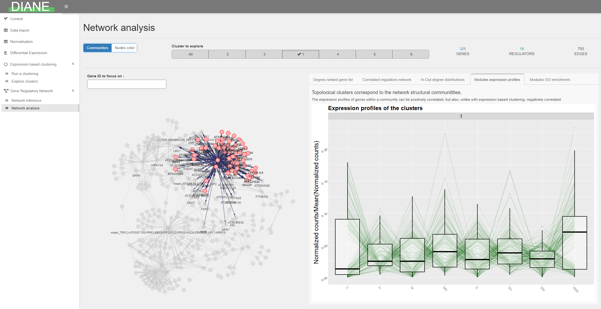

```{r, include = FALSE}
knitr::opts_chunk$set(
  collapse = TRUE,
  comment = "#>"
)
```

The Dashboard for the Inference and Analysis of Networks from Expression data is a web service as well as a local program, created to elucidate regulatory pathways from gene expression datasets.

# Discover the user interface

DIANE can be used at https://diane.bpmp.inrae.fr, or locally installed.

In case of local use, it is launched with the following R code lines :

```{r setup, eval=FALSE}
library(DIANE)
run_app()
```

As a statistical analysis pipeline, DIANE is meant to be sequentially used, so please follow the order of the tab items in the left side of the interface.

You will find listed below the different possibilities and analyses offered by this tool.

# Data upload and organisms

You should upload in DIANE the raw counts that were obtained after the bioinformatic pipeline of mapping and quantification of your reads. It gives, for each gene, the transcript abundance found in each of your experimental condition and replicates.

The application tab for dataset upload is shown below :


A number of model organisms are already stored in the application, so that, if your expression file contains the expected gene IDs, an annotation will automatically be found and displayed along the pipeline. This includes gene labels, description, ontologies and transcriptional regulators.

Else, you can upload those information for your organism.
You can find more information on data upload in the corresponding vignette article.

# Normalization and low counts filtering



This tab allows to correct for differences in sequencing depths, so that all samples are comparable in downstream analysis.

Three state of the art normalization methods are provided : TMM, DESeq2, or TCC.

In case your data is already normalized, this part can be skipped.

# Exploratory analysis

To assess sample homogeneity and while having first glimpse at the experimental factors driving gene expression, dimensonality reduction techniques such as PCA or MDS are available.



It is also possible to visualize the expression levels of particular genes in your dataset.

# Differential expression analysis

This tab allows to detect genes with significant expression change between two transcriptomes.

To do so, select the conditions that you want to compare for differential expression, and they will be the one tested against one another via likelihood ratio tests, as implemented in EdgeR. It is also possible to select multiples conditions as references and/or perturbations to make more complex comparisons. 

The results are presented in a dataframe, ordered by adjusted pvalues (FDR). The dataframe contains the log2 fold changes (logFC), the average expression (logCPM) for each genes which FDR is lower than the specified adjusted p-value threshold. You can also choose to select genes having their absolute log2 fold change over a certain constant.



Various options for visualization of differentially expressed genes are proposed, such as MA plot, volcano plot, or heatmaps.




Finally, it is possible to compare lists of differentially expressed genes via Venn diagrams :


# Gene ontology analysis

Among a list of genes, the user can compute significantly enriched ontologies, and visualize the result as GO term dotplots or enrichment maps :




# Expression based clustering

Performing gene clustering to gather genes with similar behavior is proposed in this tab, via the [coseq package](https://www.bioconductor.org/packages/release/bioc/vignettes/coseq/inst/doc/coseq.html). It relies on the Mixture Models framework, and lets the user decide between Poisson or Gaussian mixtures.

The range of number of clusters to test can also be adjusted.


After the clustering step, individual clusters can be explored, via their profile visualization, gene ontology enrichment, and Poisson Generealized regression.



# Network inference

Network inference takes as input a list of genes, generated by differential expression tests, that will be the nodes of the inferred network. Among those genes, some must be identified as potential transcriptional regulators. It is also possible to use a subset of genes for network inference, as clusters determined in the expression based clustering tab.

The [GENIE3 package](https://journals.plos.org/plosone/article?id=10.1371/journal.pone.0012776) is a method based on Machine Learning (Random Forests) to infer regulatory links between target genes and regulator genes. The advantages of this method is that it returns oriented edges from regulators to targets, which is desired in the context of regulatory networks, and can capture high order interactions between regulators.

For each target gene, the methods uses Random Forests to provide a ranking of all regulators based on their influence on the target expression. This ranking is then merged across all targets, giving a global regulatory links ranking. Settings relative to regulatory weights inference are presented in the left pane.

The idea is then to keep the strongest links to build the gene regulatory network. The way of determining the right number of final edges in the network can be based on a desired network density alone, or followed by edges statistical testing. This can be adjusted in the right panel.



# Network analysis

After the inference and regulatory weights selection, the user can browse the resulting network.

Genes are color and shape-coded depending on their nature (regulators or targets), or depending on their community membership.

The first tab in the right side of the screen shows a ranking of the graph's nodes based on their connectivity. This can be used to extract regulators with a key role in the response of interest, because they are predicted to have a large number of target genes.


Network statistics such as the in and out degree distributions are available, as well as highly correlated regulators groupings.

For each topological module, the user can display their expression profiles, gene composition, or enriched go terms.



# Session reporting and communicable research

In each important step of this pipeline, it is possible to download results as csv files. Also, analyses reports can be generated so that settings used during a session in DIANE are kept, making them reproducible, and easy to share between users.

# DIANE as a programming interface

In addition to the Graphical User Interface, DIANE also comes with all it's server-side functions. They can be called from any R environment or scripts, after locally installing and loading DIANE.

Using DIANE's functions outside of the interface can be an interesting option for several reasons, among which :

+ It allows more flexibility and additional user-specific R analysis

+ It can be part of an automated pipeline
