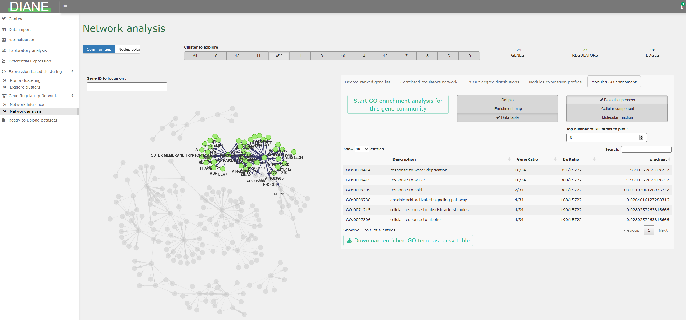

```{r, include = FALSE}
knitr::opts_chunk$set(
  collapse = TRUE,
  comment = "#>"
)
```

# User Interface

DIANE can launched with the following R code lines :

```{r setup, eval=FALSE}
library(DIANE)
DIANE::run_app()
```

DIANE is meant to be used in a sequential order, so please let you be guided by the order of the tab items in the left side of the interface.

**This document will be updated with more practical information on how to use the interface soon.**


# Import your data

## Expression file 

You should feed DIANE the raw counts that were obtained after the bioinformatic pipeline of mapping and quantification of your reads.
It gives, for each gene, the transcript aboundance found in each of your experimental condition and repliactes.
The needed matrix-like file shoud contain a column named "Gene", containing all your gene IDs.
The other columns should be your sample names, noted as follow : conditionName_replicate (see example below).
Expression values should be zeros or positive integers.


In order for your input to be compatible with the proposed organisms, it should contain gene IDs as follow :

+ For Arabidopsis thaliana : TAIR IDs (ex: AT1G01020, or AT1G01020.1) 
+ For Human : ensembl IDs (ex: ENSG00000005513) 

Here is the head of our companion expression file, from 12 Arabidopsis thaliana's samples :

```
Gene,C_1,C_2,C_3,S_1,S_2,S_3,M_1,M_2,M_3,H_1,H_2,H_3,SM_1,SM_2,SM_3,SH_1,SH_2,SH_3,MH_1,MH_2,MH_3,SMH_1,SMH_2,SMH_3
AT1G01010.1,127.0,67.9,65.5,94.0,88.1,95.9,65.1,100.3,126.8,95.4,135.0,117.2,96.7,104.4,98.1,94.7,96.1,101.3,82.8,107.4,97.1,100.1,96.7,121.8
AT1G01020.1,207.9,220.8,186.8,192.5,225.1,197.8,234.2,196.9,179.4,312.9,366.0,318.0,169.0,179.6,186.5,340.8,352.6,345.0,331.2,315.8,327.5,267.7,313.7,319.3
AT1G01030.1,32.7,34.4,55.8,33.6,15.9,31.3,21.4,29.8,33.5,47.7,39.0,51.1,25.2,31.2,34.4,61.0,65.5,61.2,45.0,36.2,55.9,46.0,42.7,56.8
```


## Design

You should also feed DIANE the experimental design corresponding to your data.
To do so, you must provide, for each condition name, the level of the factors corresponding to that condition in your study.

Let's take our companion data as an example.
Here, the experiment we chose for our demo includes 3 factors, heat stress, mannitol stress, as well as salinity stress.

 
You should first identify which level of each factor can be considered as the **control** level, and which is a **perturbation**. In our demo, the control condition is referred to as C.
Then, the perturbation are specified by their corresponding letter, from simple to triple stress combination. For example, SH corresponds to salt and heat stresses in the control level of mannitol. As a consequence, its levels would be 1,0,1.

The design file is thus a matrix with condition names as rows, and factor names as columns.
It should contain a column named "Condition", as you can see in our example below :

```
Condition,Salt_stress,Mannitol_stress,Heat_stress
C,0,0,0
H,0,0,1
S,1,0,0
M,0,1,0
SM,1,1,0
SH,1,0,1
MH,0,1,1
SMH,1,1,1
```
Many RNASeq anlysis only study one factor, which would not be a problem to use DIANE. If you have two conditions named control and trt, the design would contain only one factor column: 

```
Condition,treatment
contr,0
trt,1
```

# Normalize and filter low counts

The [TCC R package](https://rdrr.io/bioc/TCC) is used for the normalisation step here, to make samples comparable by correcting for their differences in **sequencing depths**. This step is mandatory before further statitical analysis.

You can choose to normalize using the methods implemented in edgeR, referenced as 'tmm', or the one used in DESeq, referenced as 'deseq2'.

Those normalisation methods rely on the hypothesis that a very small proportion of genes are differentially expressed between your samples. If you suspect a lot of genes could be differentially expressed in your data, TCC offers the possibility to proceed to a first detection of potential differentially expressed genes, to remove them, and then provide a final less biased normalisation.

In that case, enable "prior removal of differentially expressed genes".
TCC will perform the following setp, depending on the normalisation method you chose :
+ tmm/deseq2 temporary normalisation
+ potential DEG identification and removal using edgeR test method
+ tmm/deseq2 definitive normalisation   


Removing genes with very low aboundance is a common practice in RNA-Seq analysis pipelines for several reasons :


+ They have little biological signifiance, and could be caused either by noise or mapping errors.


+ The statitical modelling we are planning to perform next is not well suited for low counts, as they make the mean-variance relationship harder to estimate.

There is no absolute and commonly accpeted threshold value, but it is recommended to allow only genes with more than 10 counts per sample in average. DIANE thus proposes a threshold at 10*sampleNumber, but feel free to experiment with other values depending on your dataset.


# Differential expression analysis


In DIANE, the dispersion estimation and model fitting is done only once, and statistical tests for differentially expressed genes can be done for different contrasts.
To do so, select the conditions that you want to compare for differential expression, and they will be the one tested againt one another via likelihood ratio tests.

The results are presented in a dataframe, ordered by adjusted pvalues (FDR). The dataframe contains the log fold changes (logFC), the average expression (logCPM) for each genes which FDR is lower than the specified adjusted p-value threshold.
You can also choose to to select one genes having an absolute log fold change over a certain constant.


Various options for visualisation of differentially expressed genes are proposed, such as MA plot, volcano plot, or heatmaps.


# Gene ontology analysis


# Expression based clustering


# Network inference

The [GENIE3 package](https://journals.plos.org/plosone/article?id=10.1371/journal.pone.0012776) is a method mased on machine learning to infer regulatory links between genes and regulators.

GENIE3 needs to be fed a list of genes, that will be the nodes of the inferred network. Among those genes, some must be considered as potential regulators. 

GENIE3 can determine the influence if every regulators over each input genes, using their respective expression profiles. You can specify which conditions you want to be consired for those profiles during the network inference.

For each target gene, the methods uses Random Forests to provide a ranking of all regulators based on their influence on the target expression. This ranking is then merged across all targets, giving a global regulatory links ranking.

The idea is then to keep the strongest links to build the gene regulatory network. The way of choosing this minimal importance value needed to be included in the network will be described the "thresholding" box.

GENIE3 was among the best performers of the [DREAM challenge](https://www.synapse.org/#!Synapse:syn2787209/wiki/70350), designed to benchmarck state of the art network inference methods of simulated and validated biological data. The advantages of the method is that it only gives oriented edges from regulators to targets, which is desired in the context of regultory networks, and captures regulators interactions and combinatorics. 


Without thresholding, we would obtain a fully cnnected weighted graph from GENIE3, with far too many links to be interpretable.

In order build a meaningfull network, this weighted adjacency matrix betwen regulators and targets has to be sparsified, and we have to determine the regulatory weights that we consider significant.

A first approach is hard thresholding on a desired number of links. If we want a network with 1000 edges, then we choose the 1000 strongest interactions. Usually, gene networks have have a number of edges comparable to their number of nodes, or a little but more. As a first and naive solution, we propose to threshold the network to a number of edges being 1.5*V with V being the number of nodes.
Of course, you can modify the value to use your own threshold.

A more sophisticated method turning regulatory links into pvalues and allowing for significance testing on those links is currently being implemented and will be proposed soon.


# Network analysis

details to come





